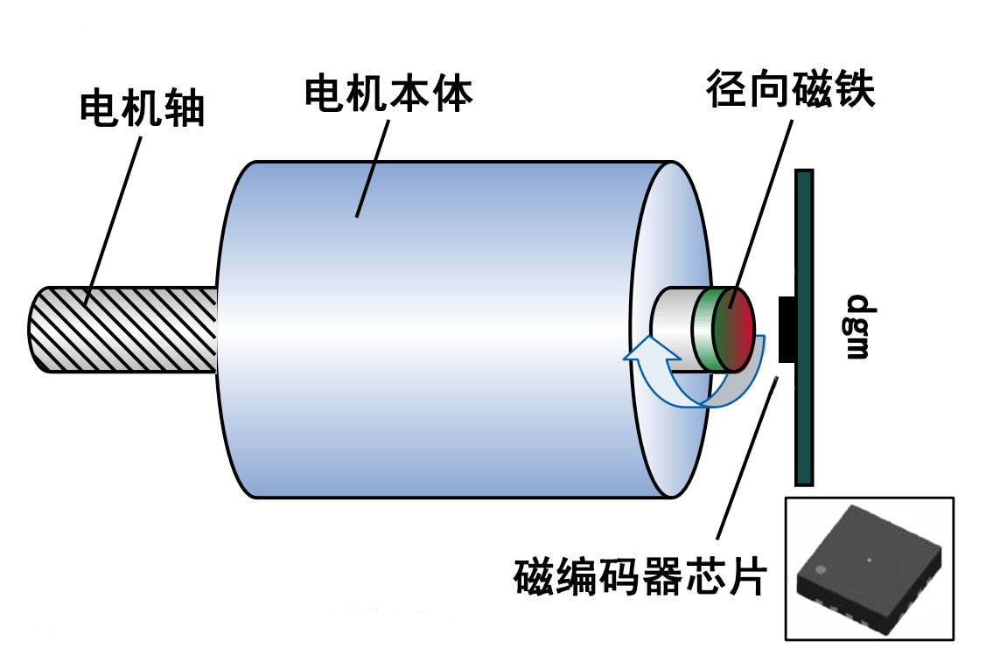
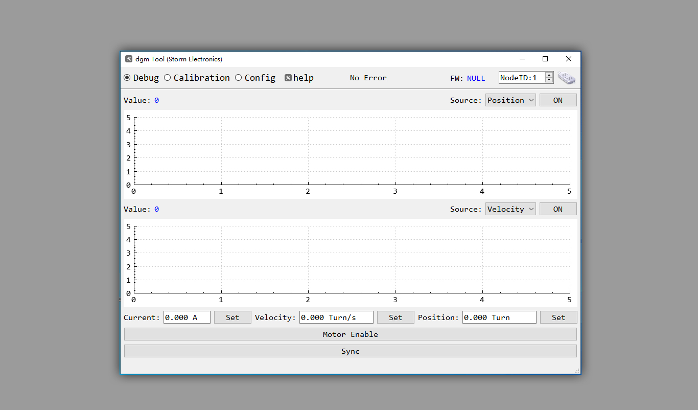
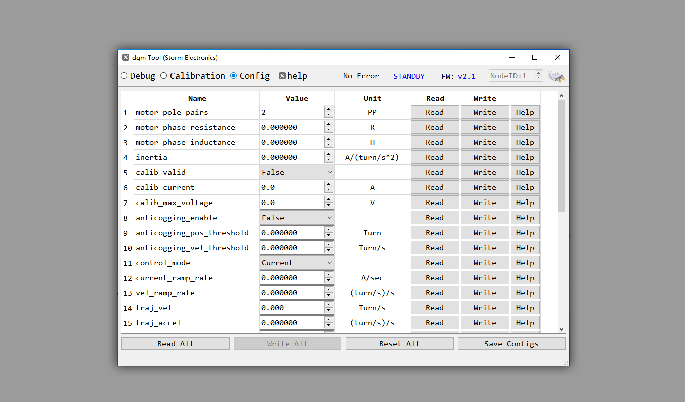
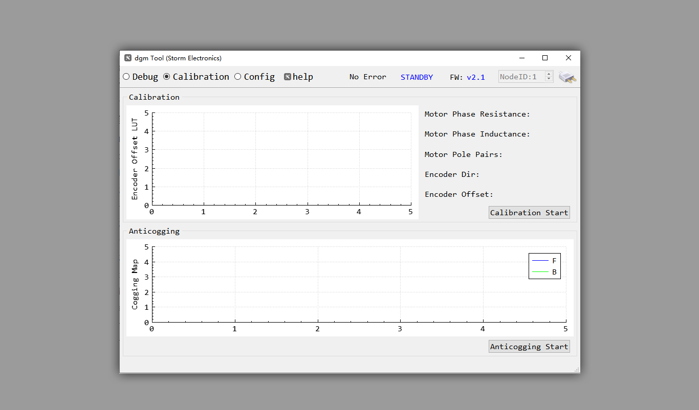

# dgm 电机驱动器简介

****

**dgm 驱动器是一款高度集成、高效率、高功率密度、简单易用的无刷马达驱动器 (固件代码开源)。该驱动器包含必要的调试和数字通讯接口(UART、CAN总线)。**

## 主要特点

- **超小的尺寸，长4 cm 宽 4 cm。**
- **支持宽电压范围供电(12V ~ 50V)。**
- **高达 95% 的工作效率。**
- **采用 6 颗 60V/170A MOSFET。**
- **采用 Cortex-M4 带硬件浮点运算器主控。**
- **采用 SVPWM 控制方式。**
- **高达 20 KHz 的电流、转速、位置控制频率。**
- **基于 12bit ADC 三相电流检测，相电流测量范围 -45~+45A，满量程分辨率 22mA。**
- **板载一颗分辨率高达 18bit 绝对值磁编码器芯片，实现精确位置控制，无需每次上电校准电机编码器。**
- **支持磁编码器和感应磁铁同心度偏移补偿。**
- **支持马达齿槽转矩脉动补偿。**
- **支持自动测量电机相关参数并根据电机参数生成电流环控制增益。**
- **该驱动器可以使用UART或CAN总线进行配置和控制。**
- **可以使用配套的 dgm_tool 可视化调试软件轻松配置和调试。**

## 典型应用

- **协作机器人关节**
- **机器人末端执行器**
- **机器人外骨骼**
- **AGV**
- **高集成度伺服电机**
- **航模 BLDC 电机**

## 关键参数

|   **关键参数**   | **单位** |                    **参数**                    |
| :--------------: | :------: | :--------------------------------------------: |
|   **输入电压**   |  **V**   |                   **12~50**                    |
|  **持续相电流**  |  **A**   |              **30A @ 60 摄氏度**               |
|  **峰值相电流**  |  **A**   |                 **60A @ 1 秒**                 |
|   **PWM频率**    | **kHz**  |                     **20**                     |
|   **待机功耗**   |  **W**   |                **0.72W @ 24V**                 |
| **支持电机类型** |          |              **三相无刷永磁电机**              |
|  **编码器类型**  |          | **板载在轴单圈绝对值磁编码器 (分辨率 18 bit)** |
|   **通讯接口**   |          |               **UART、CAN总线**                |
|   **控制模式**   |          |       **电流、转速、位置、梯形轨迹位置**       |

***以上参数非特殊说明即表示极限参数，超过将可能造成驱动器损坏！***

## 机械尺寸

**3D step 模型下载地址如下：**
[https://github.com/codenocold/dgm/blob/main/dgm_v2_0/Hardware/dgm_rev2_0_3D.step](https://github.com/codenocold/dgm/blob/main/dgm_v2_0/Hardware/dgm_rev2_0_3D.step)

**PDF版工程图下载地址如下：**[https://github.com/codenocold/dgm/blob/main/dgm_v2_0/Hardware/dgm_rev2_0_%E5%B0%BA%E5%AF%B8%E5%9B%BE.PDF](https://github.com/codenocold/dgm/blob/main/dgm_v2_0/Hardware/dgm_rev2_0_%E5%B0%BA%E5%AF%B8%E5%9B%BE.PDF)

## 接线端口说明

****

### J1 调试接口

**SH1.0 7P 卧贴耐高温端子**

| **引脚** | **功能**       |
| -------- | -------------- |
| **1**    | **串口 RX**    |
| **2**    | **串口 TX**    |
| **3**    | **备用 IO**    |
| **4**    | **数字信号地** |
| **5**    | **SWDIO**      |
| **6**    | **SWCLK**      |
| **7**    | **3.3V**       |

### T1 CAN终端电阻选择端

**默认为断开状态，即不启用板载CAN总线120Ω电阻，如果需要启用CAN终端电阻使用焊锡短路此处即可。**

### J2 CAN总线

**SH1.0 3P 卧贴耐高温端子。**

| **引脚** | **功能**       |
| -------- | -------------- |
| **1**    | **数字信号地** |
| **2**    | **CAN H**      |
| **3**    | **CAN L**      |

### P1 电源

**长 18mm 宽 6.6mm 镀金焊盘(双面)，相邻焊盘中心间距  4.57mm**

| **引脚** | **功能**                   |
| -------- | -------------------------- |
| **1**    | **电源负极**               |
| **2**    | **电源正极 (耐压12v~50v)** |

***注意：供电接线请确保不要接反，否则可能烧坏驱动板！***

### P2 电机

**长 18mm 宽 6.6mm 镀金焊盘(双面)，相邻焊盘中心间距  7.75mm**

| **引脚** | **功能**      |
| -------- | ------------- |
| **1**    | **电机 C 相** |
| **2**    | **电机 B 相** |
| **3**    | **电机 A 相** |

# 硬件准备

## 安装径向磁铁和dgm驱动板

**如上图所示**

1. 使用强力胶或转接座将径向磁铁固定在电机旋转轴末端上。虽然dgm驱动器会在校准过程中进行轴心偏移补偿，但为了更好的精度请尽量使径向磁铁轴心和电机轴轴心同心。
2. 将dgm驱动板固定到电机定子或者壳体上，使dgm驱动板背面的磁编码器芯片位于径向磁铁正上方，且磁编码器芯片表面距离径向磁铁表面 2mm 以内来保证磁编码器所需要的磁场强度。

## 连接电机

将三根电机线分别焊接到 dgm 驱动板的 P2 接线端口的 A，B，C 焊盘上，三根线不分顺序，任意焊接即可，dgm驱动器会在校准过程中自动匹配。

***提示：如果想要改变电机指令旋转方向和实际旋转方向可以任意对调其中两根线即。***

## 连接电脑

根据需要准备 **USB转串口模块** 或者 **USB转CAN模块** (目前仅支持 [Cando](https://item.taobao.com/item.htm?spm=a230r.1.14.6.458c30e3ims9dC&id=592036191992&ns=1&abbucket=13#detail) 或者 [Cando_pro](https://item.taobao.com/item.htm?spm=a230r.1.14.1.458c30e3ims9dC&id=610739408298&ns=1&abbucket=13#detail) 模块)，连接 dgm 驱动器和电脑。

### 选择一 使用 USB转CAN模块

| **USB转CAN模块** | **dgm驱动板** |
| ---------------- | ------------- |
| GND              | J2-1    GND   |
| CAN H            | J2-2    CAN H |
| CAN L            | J2-3    CAN L |

### 选择二 使用 USB转串口模块

| **USB转串口模块** | **dgm驱动板** |
| ----------------- | ------------- |
| RX                | J1-2    TX    |
| TX                | J1-1    RX    |
| GND               | J1-4    GND   |

## 连接供电电源

- 调试阶段供电电源建议使用可调稳压电源，调试完毕后更换为电池或开关电源。

将红色源线焊接到 dgm 驱动板 P1 接线端口标有 **+** 的焊盘上，将黑色电源线焊接到dgm驱动板 P1 接线端口标有 **-** 的焊盘上。然后将黑色线接电源负极，红色线接电源正极。**注意：进行接线操作时保持电源处于断电状态！**

## 硬件准备完成示意图

## 安全上电

- 安全的开启电源，如果使用的鳄鱼夹手动连接电源线会产生小火花，这是由于电容充电导致，属于正常现象。**注意：建议上电前再次确认正负极是否连接正确，以免接反导致 dgm 驱动板损坏！**
- 接通电源后 dgm 驱动板上的 PWR 绿色指示灯将保持常亮，ACT 蓝色指示灯开始闪烁，ACT 蓝色指示灯通过不同的闪烁频率来指示当前驱动器工作状态。

# 使用 dgm Tool 调试

# dgm 驱动板购买链接

- **暴风电子@taobao：**[购买链接](https://item.taobao.com/item.htm?ft=t&id=645970525370)