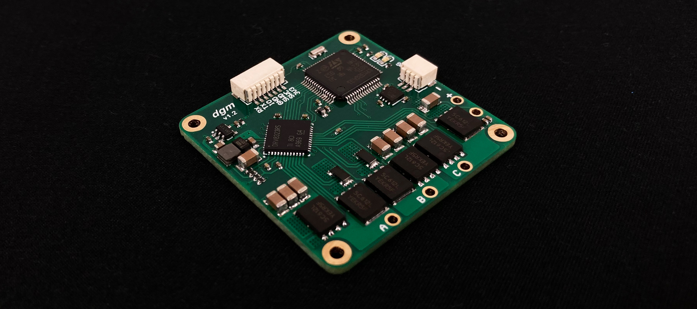
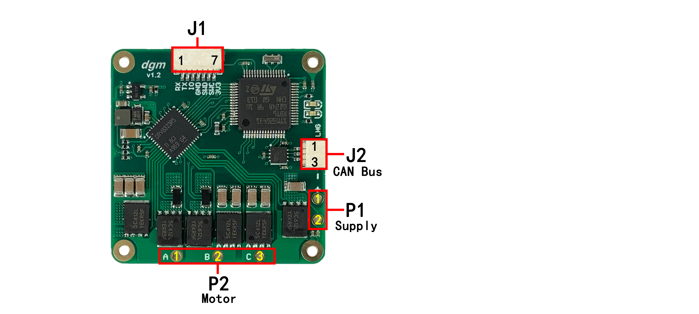
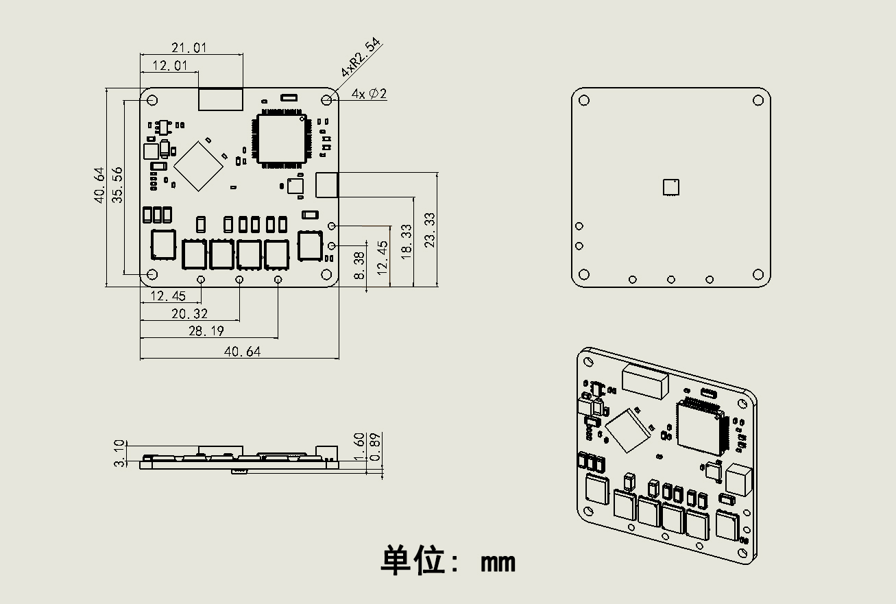
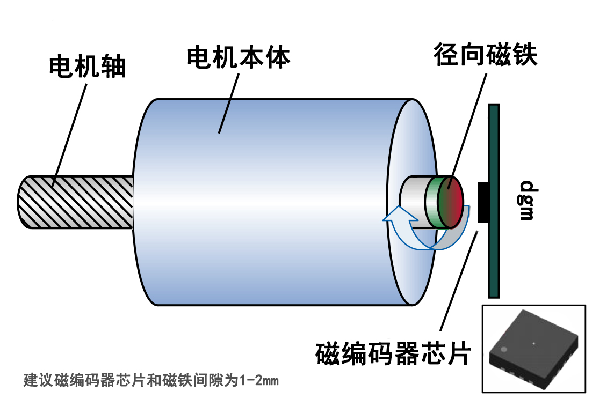
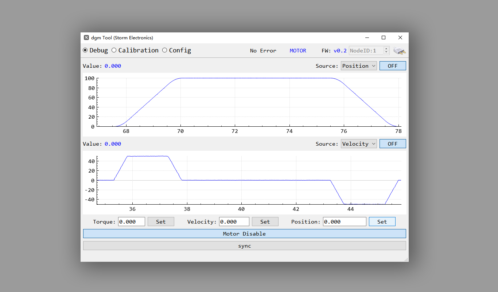
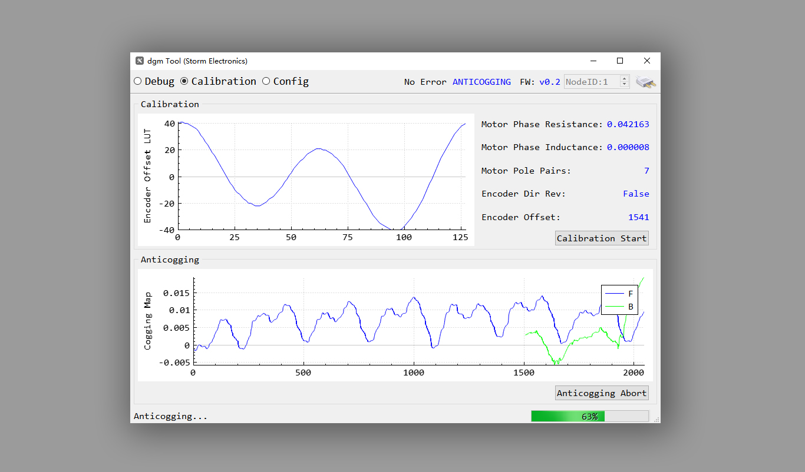
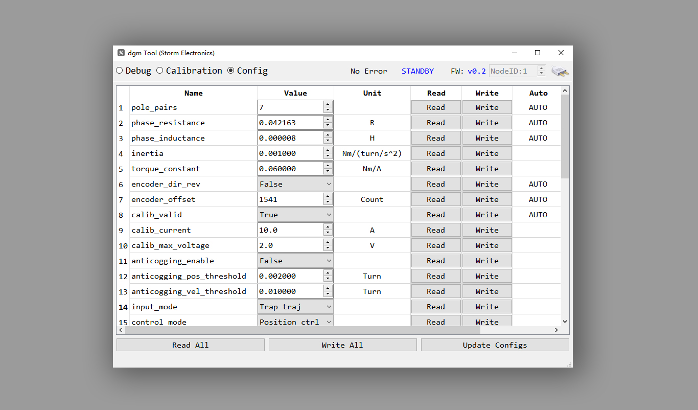
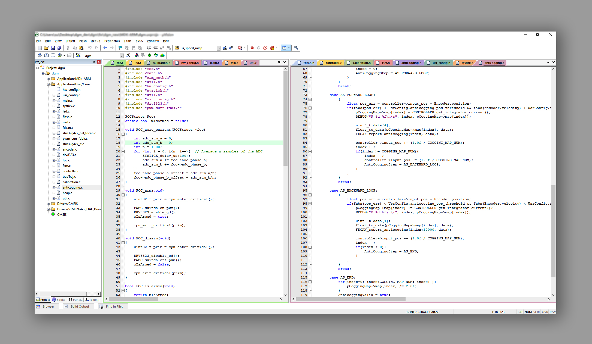
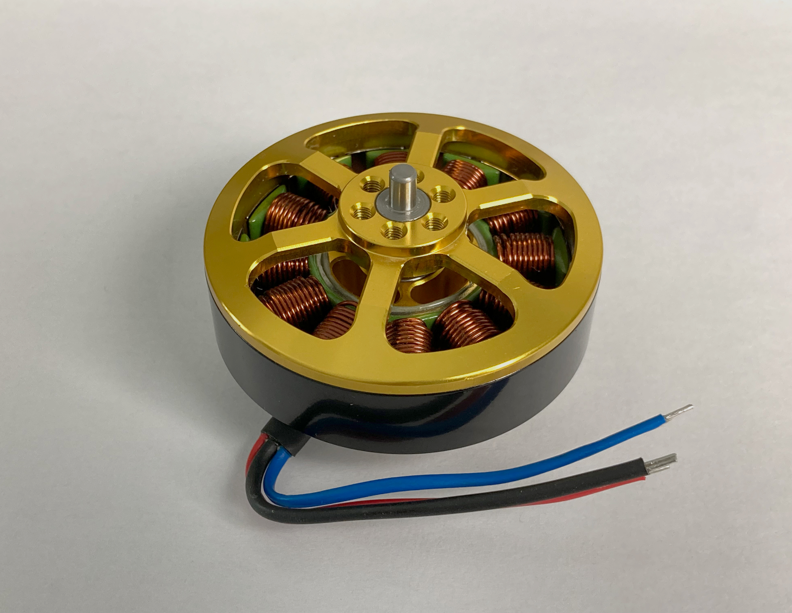

# dgm 电机驱动板

[TOC]

****

***dgm* 是一款高度集成、高效率、简单易用的无刷马达驱动器 (固件代码开源)。**

- **集成了一颗分辨率 14bit 的绝对值磁编码器芯片，因此无需每次上电校准电机编码器。**
- **支持马达齿槽转矩脉动补偿。**
- **支持磁编码器和感应磁铁同心度偏移补偿。**
- **支持自动测量电机相关参数并根据电机参数生成合适的电流环控制增益。**
- **该驱动器可以使用串口或CAN总线进行配置和控制。**
- **通过CAN总线使用 dgm_tool 调试软件轻松配置。**

|   **关键参数**   | **单位** |               **参数**               |
| :--------------: | :------: | :----------------------------------: |
|   **输入电压**   |  **V**   |               **9~50**               |
|   **持续电流**   |  **A**   |                **30**                |
|   **峰值电流**   |  **A**   |                **60**                |
|   **PWM频率**    | **kHz**  |                **25**                |
| **支持电机类型** |          |         **三相无刷永磁电机**         |
|  **编码器类型**  |          | **板载在轴磁编码器 (分辨率 14 bit)** |
|   **通讯接口**   |          |            **UART、CAN**             |
|   **控制模式**   |          |    **力矩、转速、位置、轨迹位置**    |

# **接线端口**

****

## **供电 P1**

**2.2mm(外径) 1.4mm(内径) 镀金焊盘，相邻焊盘中心间距  4mm。**

| **引脚** | **功能**                  |
| -------- | ------------------------- |
| **1**    | **电源负极**              |
| **2**    | **电源正极 (耐压9v~50v)** |

## **电机 P2**

**2.2mm(外径) 1.4mm(内径) 镀金焊盘，相邻焊盘中心间距  7.874mm。**

| **引脚** | **功能**      |
| -------- | ------------- |
| **1**    | **电机 A 相** |
| **2**    | **电机 B 相** |
| **3**    | **电机 C 相** |

## **调试接口 J1**

**SH1.0 7P 卧贴耐高温端子。**

| **引脚** | **功能**       |
| -------- | -------------- |
| **1**    | **串口 RX**    |
| **2**    | **串口 TX**    |
| **3**    | **备用 IO**    |
| **4**    | **数字信号地** |
| **5**    | **SWDIO**      |
| **6**    | **SWCLK**      |
| **7**    | **3.3V**       |

## **CAN总线 J2**

**SH1.0 3P 卧贴耐高温端子。**

| **引脚** | **功能**       |
| -------- | -------------- |
| **1**    | **数字信号地** |
| **2**    | **CAN H**      |
| **3**    | **CAN L**      |

# **尺寸**

****

# **安装示意图**

****

# **调试软件 dgm Tool**

**调试软件需要使用本店的Cando或Cando_pro(usb转can模块)通过can总线连接 dgm电机驱动板和电脑，由于驱动板固件开源所以也可以自己根据can通讯协议使用其它can通讯工具和 dgm 驱动板进行通讯和控制。**

****

****

****

# **Keil mdk 固件源代码**

****

# 电机参数

| 外壳直径         | 58.5mm     |
| ---------------- | ---------- |
| **总高度**       | **40mm**   |
| **重量**         | **182g**   |
| **KV值**         | **280**    |
| **槽数、磁极数** | **12N14P** |
| **额定电压**     | **24v**    |
| **功率**         | **450w**   |