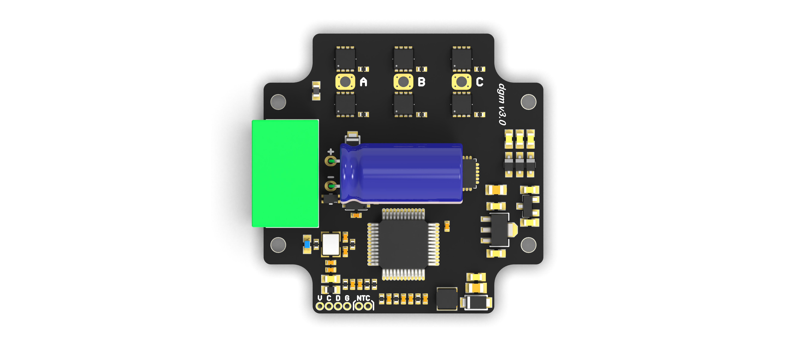

## 仓库文件结构

- [Firmware_app](https://github.com/codenocold/dgm/tree/main/Firmware_app)：dgm驱动器固件源码
- [Firmware_boot](https://github.com/codenocold/dgm/tree/main/Firmware_boot)：dgm驱动器boot源码
- [Hardware](https://github.com/codenocold/dgm/tree/main/Hardware)：电路原理图，3D模型文件
- [dgm_tool](https://github.com/codenocold/dgm/tree/main/dgm_tool)：dgm_tool 可视化调试软件
- [dgm电机驱动器用户手册.pdf](https://github.com/codenocold/dgm/blob/main/dgm%E7%94%B5%E6%9C%BA%E9%A9%B1%E5%8A%A8%E5%99%A8%E7%94%A8%E6%88%B7%E6%89%8B%E5%86%8C.pdf)：用户使用手册

****

## 主要特点

- **原理图&固件代码开源**
- **支持马达齿槽转矩脉动补偿**
- **超小的尺寸，长4 cm 宽 4 cm**
- **支持宽电压范围供电(12V ~ 50V)**
- **采用 Cortex-M4 带硬件浮点运算器主控**
- **支持磁编码器和感应磁铁同心度偏移补偿**
- **配套的 dgm tool 可视化调试软件轻松配置和调试**
- **支持自动测量电机相关参数并根据电机参数生成电流环控制参数**
- **基于 12bit ADC 相电流检测，相电流测量范围 -10 ~ +10A，满量程分辨率 5mA**
- **板载单圈绝对值磁编码器芯片，实现精确位置控制，无需每次上电校准电机编码器**

## 典型应用

- **AGV**
- **机器人外骨骼**
- **一体化伺服电机**
- **协作机器人关节**
- **航模 BLDC 电机**
- **机器人末端执行器**

## 关键参数

- **额定电压：24V（峰值不高于50V）**
- **最大电流：10A (相电流)**
- **电机类型：三相永磁电机/BLDC/PMSM**
- **编码器位数：14bit**
- **编码器类型：AMR磁编码器**

- **控制模式：电流爬升、速度爬升、位置过滤、轮廓位置**
- **通讯接口：CAN总线，支持CAN-FD（需自行开发固件支持）**

## 端口和机械尺寸

- **J1 供电和CAN通讯**
- **J2 三相无刷电机**
- **J3 SWD调试接口**
- **J4 外置NTC接口**

## 安装示意

## 安装规范

## 使用 dgm tool 调试

**dgm tool 是专门为dgm驱动器开发的一款简单易用的可视化上位机调试软件，目前仅支持通过 [CAN-FD 模块](https://item.taobao.com/item.htm?spm=a230r.1.14.1.458c30e3ims9dC&id=610739408298&ns=1&abbucket=13#detail) 连接电脑使用。**

**dgm tool 适用于 Windows8 及以上64位版本操作系统，双击 dgm_tool 文件夹下的 dgm_tool_x64-X.X.exe运行即可。**

## 调试界面

## 校准界面

## 参数配置界面

## 固件升级界面

## keil mdk 固件源代码

## dgm 驱动板原理图

## dmg 驱动器用户手册

## 配套电机参数

| 额定电压     | 24V         |
| ------------ | ----------- |
| **额定电流** | **3.2A**    |
| **额定转速** | **3500rpm** |
| **额定转矩** | **0.13Nm**  |
| **额定功率** | **55W**     |
| **磁极对数** | **4**       |
| **电机重量** | **0.45Kg**  |

## dgm 驱动板购买链接

- **暴风电子@taobao：**[购买链接](https://item.taobao.com/item.htm?ft=t&id=645970525370)
