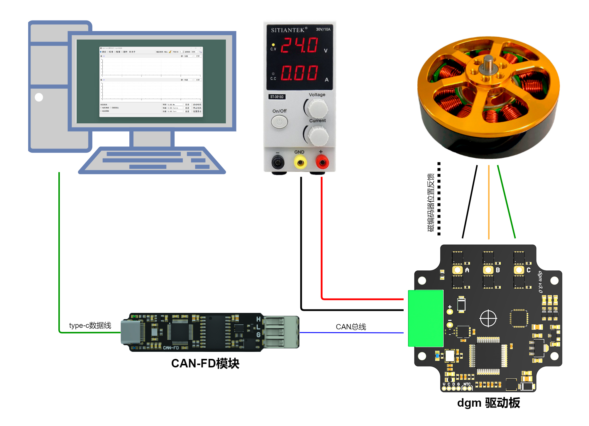
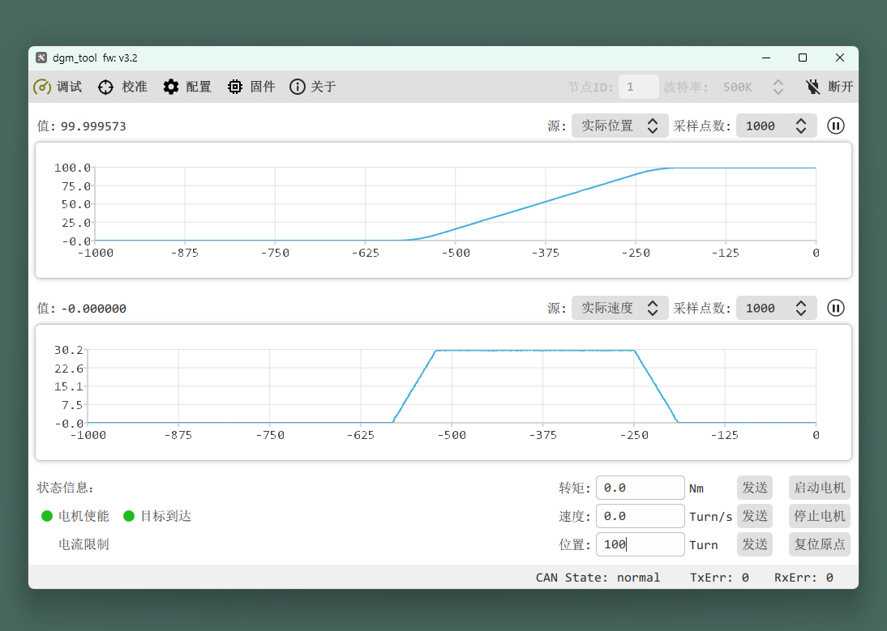
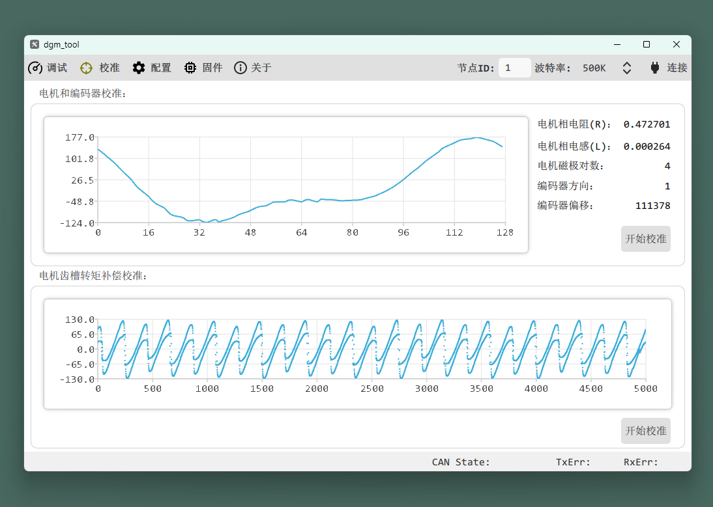
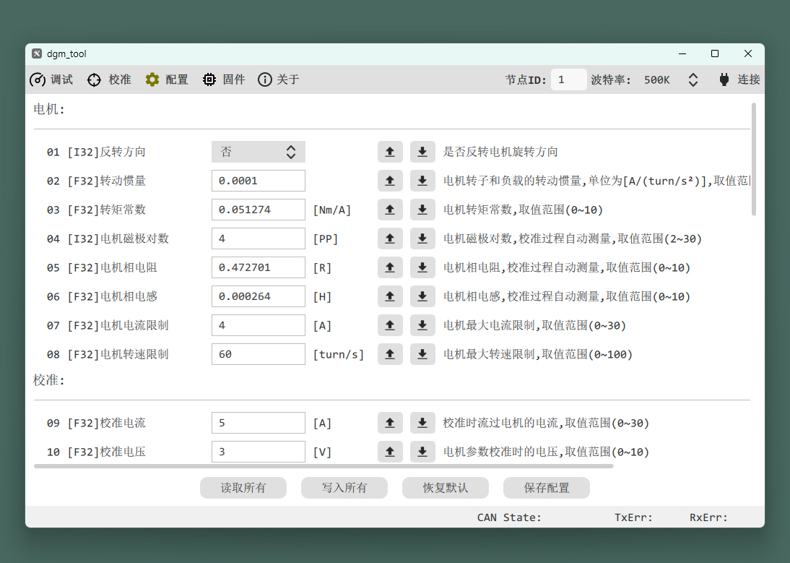
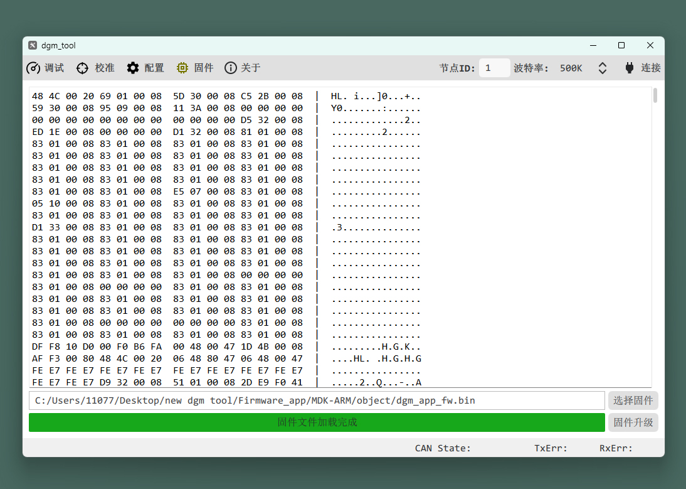
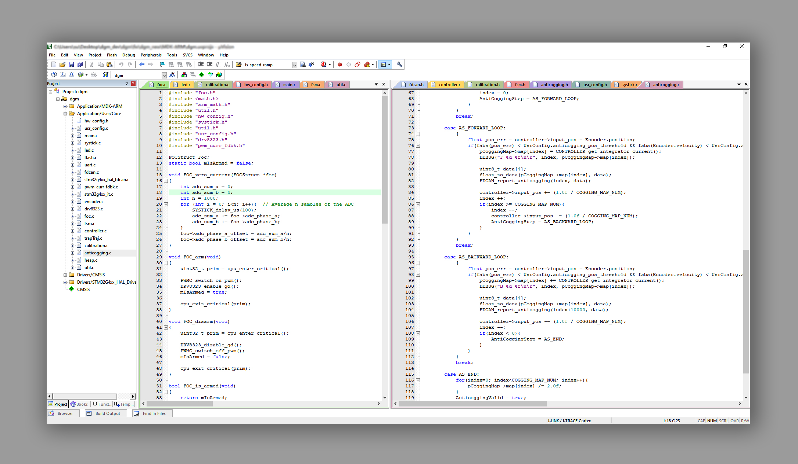
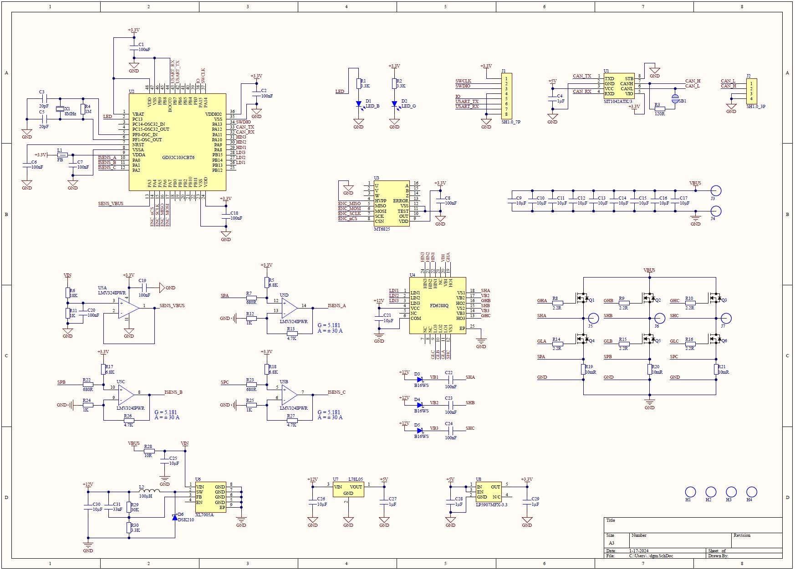
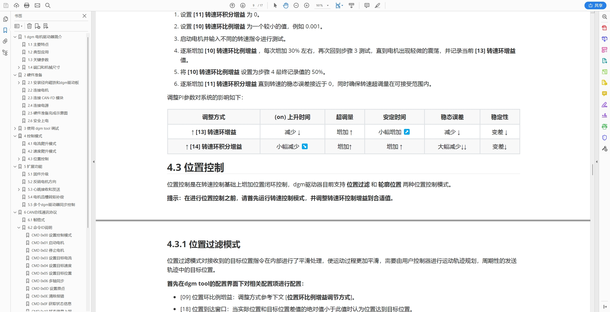

# 仓库文件结构

- [Firmware_app](https://github.com/codenocold/dgm/tree/main/Firmware_app)：dgm驱动器固件源码
- [Firmware_boot](https://github.com/codenocold/dgm/tree/main/Firmware_boot)：dgm驱动器boot源码
- [Hardware](https://github.com/codenocold/dgm/tree/main/Hardware)：电路原理图，3D模型文件
- [dgm_tool](https://github.com/codenocold/dgm/tree/main/dgm_tool)：dgm_tool 可视化调试软件

- [dgm电机驱动器用户手册.pdf](https://github.com/codenocold/dgm/blob/main/dgm%E7%94%B5%E6%9C%BA%E9%A9%B1%E5%8A%A8%E5%99%A8%E7%94%A8%E6%88%B7%E6%89%8B%E5%86%8C.pdf)：用户使用手册

# dgm电机驱动器简介

****	**dgm 驱动器是一款高度集成、高效率、高功率密度、简单易用的开源（硬件原理图、固件源代码）无刷马达驱动器。**

## 主要特点

- **采用 FOC 控制方式**
- **支持马达齿槽转矩脉动补偿**
- **超小的尺寸，长4 cm 宽 4 cm**
- **采用 6 颗 60V/170A MOSFET**
- **支持宽电压范围供电(12V ~ 48V)**
- **采用 Cortex-M4 带硬件浮点运算器主控**
- **支持磁编码器和感应磁铁同心度偏移补偿**
- **配套的 dgm tool 可视化调试软件轻松配置和调试**
- **支持自动测量电机相关参数并根据电机参数生成电流环控制增益**
- **基于 12bit ADC 三相电流检测，相电流测量范围 -30 ~ +30A，满量程分辨率 15mA**
- **板载一颗分辨率高达 18bit 单圈绝对值磁编码器芯片，实现精确位置控制，无需每次上电校准电机编码器**

## 典型应用

- **AGV**
- **机器人外骨骼**
- **协作机器人关节**
- **航模 BLDC 电机**
- **机器人末端执行器**
- **高集成度伺服电机**

## 关键参数

|   **输入电压**   |                     **12V~48V**                      |
| :--------------: | :--------------------------------------------------: |
|   **输出电流**   |                **10ARMS**                 |
|   **PWM频率**    |                      **20KHz**                       |
|   **待机功耗**   |                      **0.72W**                       |
| **支持电机类型** |              **三相永磁电机/BLDC/PMSM**              |
|  **编码器类型**  | **驱动板内部集成单圈绝对值磁编码器 (分辨率 18 bit)** |
|   **通讯接口**   |                **CAN总线、UART、IO**                 |
|   **控制模式**   |      **转矩爬升、转速爬升、位置过滤、轨迹位置**      |

***注意：以上参数非特殊说明即表示极限参数，超过将可能造成驱动器损坏！***

## 机械尺寸

## 接线端口说明

****

### J1 调试接口

**SH1.0 7P 卧贴耐高温端子**

| **引脚** | **功能**       |
| -------- | -------------- |
| **1**    | **串口 RX**    |
| **2**    | **串口 TX**    |
| **3**    | **备用 IO**    |
| **4**    | **数字信号地** |
| **5**    | **SWDIO**      |
| **6**    | **SWCLK**      |
| **7**    | **3.3V**       |

### J2 CAN总线

**SH1.0 3P 卧贴耐高温端子**

| **引脚** | **功能**       |
| -------- | -------------- |
| **1**    | **数字信号地** |
| **2**    | **CAN H**      |
| **3**    | **CAN L**      |

### T1 CAN终端电阻选择端

**默认为断开状态，即不启用板载CAN总线120Ω电阻，如果需要启用CAN终端电阻使用焊锡短路此处即可**

### P1 电源

**长 3.5mm 宽 2.5mm 镀金焊盘(双面)，相邻焊盘中心间距 4.57mm**

| **引脚** | **功能**                   |
| -------- | -------------------------- |
| **1**    | **电源负极**               |
| **2**    | **电源正极 (耐压12v~48v)** |

***注意：供电接线请确保不要接反，否则可能烧坏驱动板！***

### P2 电机

**长 3.5mm 宽 2.5mm 镀金焊盘(双面)，相邻焊盘中心间距 7.75mm**

| **引脚** | **功能**      |
| -------- | ------------- |
| **1**    | **电机 C 相** |
| **2**    | **电机 B 相** |
| **3**    | **电机 A 相** |

# 硬件准备

## 安装径向磁铁和dgm驱动板

### 安装示意

### 安装规范

### 安装效果

## 硬件准备完成示意图

## 安全上电

- 安全的开启电源，如果使用的鳄鱼夹手动连接电源线会产生小火花，这是由于电容充电导致，属于正常现象。

    ***注意：建议上电前再次确认正负极是否连接正确，以免接反导致 dgm 驱动板损坏！***

- 接通电源后 dgm 驱动板上的 PWR 绿色指示灯将保持常亮，ACT 蓝色指示灯开始闪烁，ACT 蓝色指示灯通过不同的闪烁频率来指示当前驱动器工作状态。

# 使用 dgm tool 调试

**dgm tool 是专门为 dgm 驱动器开发的一款简单易用的可视化上位机调试软件，目前仅支持通过  [CAN-FD 模块](https://item.taobao.com/item.htm?spm=a230r.1.14.1.458c30e3ims9dC&id=610739408298&ns=1&abbucket=13#detail) 连接电脑使用。**

**dgm tool 适用于 Windows8 及以上64位版本操作系统，双击 dgm_tool 文件夹下的 dgm_tool_x64-X.X.exe运行即可。**

## dgm tool 界面预览

### 调试界面

### 校准界面

### 配置界面

### 固件升级界面

## Keil mdk 固件源代码

## dgm 驱动板原理图

## dmg 用户手册

# dgm 驱动板购买链接

- **暴风电子@taobao：**[购买链接](https://item.taobao.com/item.htm?ft=t&id=645970525370)

