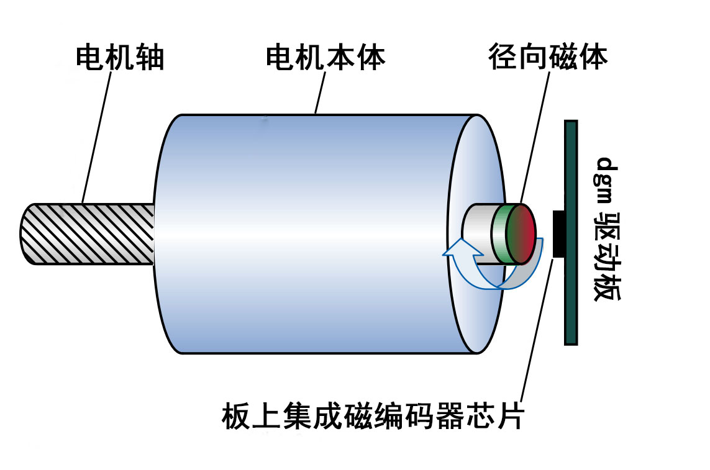

# 仓库文件结构

- [dgm_v1_2](https://github.com/codenocold/dgm/tree/main/dgm_v1_2)：v1.2 硬件版本相关资料(已不再更新)

- [dgm_v1_3](https://github.com/codenocold/dgm/tree/main/dgm_v1_3)：v1.3 硬件版本相关资料(已不再更新)
- [dgm_v2_0](https://github.com/codenocold/dgm/tree/main/dgm_v2_0)：v2.0 硬件版本相关资料
  - [Firmware_app](https://github.com/codenocold/dgm/tree/main/dgm_v2_0/Firmware_app)：dgm驱动器固件源码
  - [Firmware_boot](https://github.com/codenocold/dgm/tree/main/dgm_v2_0/Firmware_boot)：dgm驱动器boot源码
  - [Hardware](https://github.com/codenocold/dgm/tree/main/dgm_v2_0/Hardware)：电路原理图，3D模型，尺寸图等
  - [dgm_tool](https://github.com/codenocold/dgm/tree/main/dgm_v2_0/dgm_tool)：可视化调试软件
- [dgm电机驱动器用户手册_版本C.pdf](https://github.com/codenocold/dgm/blob/main/dgm_v2_0/dgm电机驱动器用户手册_版本C.pdf)：用户使用手册

#  dgm电机驱动器简介

**作者：** codenocold@qq.com/codenocold@gmail.com

****

**dgm 驱动器是一款高度集成、高效率、高功率密度、简单易用的无刷马达驱动器 (固件代码开源)。**

## 主要特点
- **超小的尺寸，长4 cm 宽 4 cm。**
- **支持宽电压范围供电(12V ~ 50V)。**
- **高达 95% 的工作效率。**
- **采用 6 颗 60V/170A MOSFET。**
- **采用 Cortex-M4 带硬件浮点运算器主控。**
- **采用 SVPWM 控制方式。**
- **高达 20 KHz 的电流、转速、位置控制频率。**
- **基于 12bit ADC 三相电流检测，相电流测量范围 -50~+50A，满量程分辨率 22mA。**
- **板载一颗分辨率高达 18bit 绝对值磁编码器芯片，实现精确位置控制，无需每次上电校准电机编码器。**
- **支持磁编码器和感应磁铁同心度偏移补偿。**
- **支持马达齿槽转矩脉动补偿。**
- **支持自动测量电机相关参数并根据电机参数生成电流环控制增益。**
- **使用CAN总线进行配置、控制、固件升级。**
- **可以使用配套的 dgm tool 可视化调试软件轻松配置和调试。**

## 典型应用

- **协作机器人关节**
- **机器人末端执行器**
- **机器人外骨骼**
- **AGV**
- **高集成度伺服电机**
- **航模 BLDC 电机**

## 关键参数

|   **关键参数**   | **单位** |                       **参数**                       |
| :--------------: | :------: | :--------------------------------------------------: |
|   **输入电压**   |  **V**   |                      **12~50**                       |
|  **持续相电流**  |  **A**   |                 **30A @ 60 摄氏度**                  |
|  **峰值相电流**  |  **A**   |                    **50A @ 1 秒**                    |
|   **PWM频率**    | **kHz**  |                        **20**                        |
|   **待机功耗**   |  **W**   |                   **0.72W @ 24V**                    |
| **支持电机类型** |          |                 **三相无刷永磁电机**                 |
|  **编码器类型**  |          | **驱动板内部集成单圈绝对值磁编码器 (分辨率 18 bit)** |
|   **通讯接口**   |          |                **CAN总线、UART、IO**                 |
|   **控制模式**   |          |      **转矩爬升、转速爬升、位置过滤、轨迹位置**      |

***以上参数非特殊说明即表示极限参数，超过将可能造成驱动器损坏！***

## 机械尺寸

**3D step 模型下载地址如下：**
[https://github.com/codenocold/dgm/blob/main/dgm_v2_0/Hardware/dgm_rev2_0_3D.step](https://github.com/codenocold/dgm/blob/main/dgm_v2_0/Hardware/dgm_rev2_0_3D.step)

**PDF版工程图下载地址如下：**[https://github.com/codenocold/dgm/blob/main/dgm_v2_0/Hardware/dgm_rev2_0_%E5%B0%BA%E5%AF%B8%E5%9B%BE.PDF](https://github.com/codenocold/dgm/blob/main/dgm_v2_0/Hardware/dgm_rev2_0_%E5%B0%BA%E5%AF%B8%E5%9B%BE.PDF)

## 接线端口说明

****

### J1 调试接口

**SH1.0 7P 卧贴耐高温端子**

| **引脚** | **功能**       |
| -------- | -------------- |
| **1**    | **串口 RX**    |
| **2**    | **串口 TX**    |
| **3**    | **备用 IO**    |
| **4**    | **数字信号地** |
| **5**    | **SWDIO**      |
| **6**    | **SWCLK**      |
| **7**    | **3.3V**       |

### J2 CAN总线

**SH1.0 3P 卧贴耐高温端子**

| **引脚** | **功能**       |
| -------- | -------------- |
| **1**    | **数字信号地** |
| **2**    | **CAN H**      |
| **3**    | **CAN L**      |

### T1 CAN终端电阻选择端

**默认为断开状态，即不启用板载CAN总线120Ω电阻，如果需要启用CAN终端电阻使用焊锡短路此处即可**

### P1 电源

**长 3.5mm 宽 2.5mm 镀金焊盘(双面)，相邻焊盘中心间距 4.57mm**

| **引脚** | **功能**                   |
| -------- | -------------------------- |
| **1**    | **电源负极**               |
| **2**    | **电源正极 (耐压12v~50v)** |

***注意：供电接线请确保不要接反，否则可能烧坏驱动板！***

### P2 电机

**长 3.5mm 宽 2.5mm 镀金焊盘(双面)，相邻焊盘中心间距 7.75mm**

| **引脚** | **功能**      |
| -------- | ------------- |
| **1**    | **电机 C 相** |
| **2**    | **电机 B 相** |
| **3**    | **电机 A 相** |

# 硬件准备

## 安装径向磁铁和dgm驱动板

### 安装示意

### 安装规范

### 安装效果

## 硬件准备完成示意图

## 安全上电

- 安全的开启电源，如果使用的鳄鱼夹手动连接电源线会产生小火花，这是由于电容充电导致，属于正常现象。

  ***注意：建议上电前再次确认正负极是否连接正确，以免接反导致 dgm 驱动板损坏！***

- 接通电源后 dgm 驱动板上的 PWR 绿色指示灯将保持常亮，ACT 蓝色指示灯开始闪烁，ACT 蓝色指示灯通过不同的闪烁频率来指示当前驱动器工作状态。

# dgm tool 调试软件

**dgm tool 是专门为 dgm 驱动器开发的一款简单易用的可视化上位机调试软件，目前仅支持通过 [Cando](https://item.taobao.com/item.htm?spm=a230r.1.14.6.458c30e3ims9dC&id=592036191992&ns=1&abbucket=13#detail) 或 [Cando_pro](https://item.taobao.com/item.htm?spm=a230r.1.14.1.458c30e3ims9dC&id=610739408298&ns=1&abbucket=13#detail) 模块连接电脑使用。**

**dgm tool 适用于 Windows8 及以上64位版本操作系统，双击 dgm_tool 文件夹下的 dgm_tool-ch-x64-XXX.exe(中文版) 或 dgm_tool-en-x64-XXX.exe(英文版) 运行即可。**

## dgm tool 界面预览

### 调试界面

### 校准界面

### 配置界面

### 固件界面

# dgm 驱动板购买链接

- **暴风电子@taobao：**[购买链接](https://item.taobao.com/item.htm?ft=t&id=645970525370)

